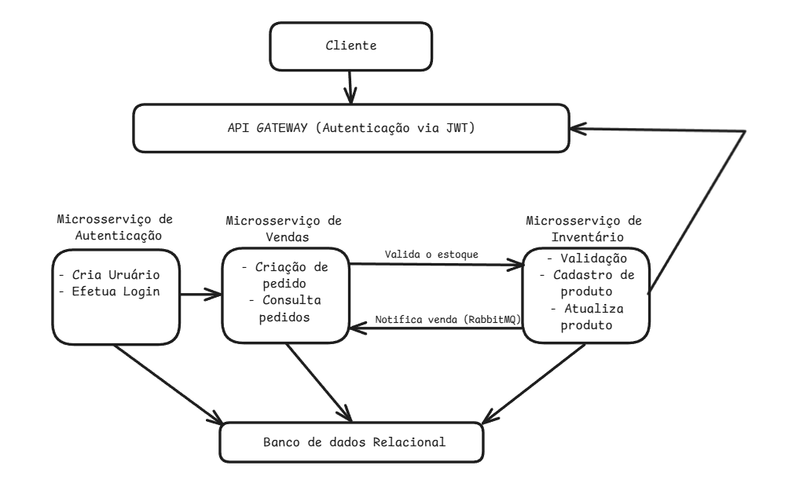

# E-commerce Microservices

Este projeto é um sistema de microserviços para um e-commerce, composto por:

- **AuthService** – Gerencia autenticação e emissão de tokens JWT.
- **InventoryService** – Gerencia produtos e estoque.
- **SalesService** – Gerencia pedidos, integra com InventoryService para atualizar estoque.
- **ApiGateway (Ocelot)** – Ponto único de entrada para todos os microserviços.

A aplicação usa **.NET 9**, **SQL Server (Docker)** e comunicação via **HTTP entre containers**.

---

## ⚙️ Tecnologias

- .NET 9
- ASP.NET Core Web API
- Entity Framework Core
- SQL Server (Docker)
- JWT Authentication
- Swagger UI
- Docker & Docker Compose
- Ocelot API Gateway
- RabbitMQ (MassTransit)

---

## 📋 Requisitos

- Docker
- Docker Compose
- .NET 9 SDK
- Navegador para acessar Swagger UI

---

## Arquitetura



---

## Passo a Passo

### 1️⃣ Clonar o projeto

```bash
git clone <seu-repositorio>
cd ecommerce-microservices
```

### 2️⃣ Ter o Docker rodando em sua máquina, neste projeto foi utilizado o Docker desktop

#### link do docker desktop: [Docker Download](https://www.docker.com/get-started/)

#### Comandos mais utilizados:

```
# iniciar
docker-compose up --build

# mostrar containers em execução
docker ps

# Finalizar containers
docker-compose down -v
```

#### Caso seus bancos não sejam criados automaticamente, rodar os comandos abaixo em um cmd powershell (pode ser via VsCode):

```
docker run -it --rm --network="ecommerce-microservices_default" mcr.microsoft.com/mssql-tools /opt/mssql-tools/bin/sqlcmd -S sqlserver -U sa -P "Str0ngP@ssword!"

CREATE DATABASE SalesDb;
GO
CREATE DATABASE InventoryDb;
GO
CREATE DATABASE AuthDb;
GO
```

### 3️⃣ Acessar os serviços via navegador nos links:

#### APIGateway: http://localhost:8000/swagger/index.html

#### AuthService: http://localhost:5000/swagger/index.html

#### InventoryService: http://localhost:5001/swagger/index.html

#### SalesService: http://localhost:5002/swagger/index.html

### 4️⃣ Testando a aplicação

#### Se tudo estiver funcionando com as rotas acessíveis no navegador, basta seguir o passo a passo abaixo:

#### 1 - Cadastrar um usuário no AuthService;

#### 2 - Fazer login com o usuário criado (utilize email e senha da criação);

#### 3 - copiar o token JWT retornado no login (ele servirá para ter autorização nos demais serviços);

#### 4 - Acessar a rota de produtos/vendas no campo _authorize_ você pode simplesmente colar o token JWT copiado no login para ter acesso aos serviços;

#### 5 - Depois de cadastrar um produto, você poderá acessar o serviço de venda utilizando o id do produto e fazer uma compra informando o preço e quantidade, ao executar a compra, o serviço de venda irá utilizar o InventoryService e reduzir do seu estoque a quantidade comprada.
